# [MODELO] RFC: Request for Comments — Projeto de Portfólio

**Engenharia de Software – Católica SC**

---

# Identificação

- **Título do Projeto:**  
Schedio Drasis

- **Linha de Projeto (Direction):**  
  Aplicação Web

- **Autor:**  
  Alexandre Sebastian Basso Muller

- **Data da Proposta:**  
13/03/2026

- **Versão:**  
  1.0

---

# 1. Visão do Produto e Impacto (O Problema)

O desenvolvimento da aplicação Web (Schedio Drasis) tem como objetivo providenciar uma área onde escritores possam publicar suas histórias ou artigos, de acordo com sua preferência, sendo esses disponíveis ao público ou mantido de maneira privada, neste caso servindo também para desenvolvedores que buscam elaborar protótipos de seus projetos. 

---

## 1.1 Contexto e Problema

Atualmente, não se encontram facilmente aplicativos ou plataformas que proporcionem ao escritor plena liberdade sobre sua obra, permitindo também disponibilizá-la ao público de forma interativa. Um gênero conhecido como “interactive fiction” consiste justamente na possibilidade de o público interagir em tempo real com o conteúdo apresentado na tela, podendo alterar o rumo da história.

Além disso, em contextos informativos, como artigos, o leitor poderia especificar ou aprofundar determinadas informações por meio de imagens adicionais ou ser redirecionado para tópicos mais específicos relacionados ao conteúdo apresentado.

Como consequência, essa liberdade de criação e interação também pode beneficiar desenvolvedores e designers de UI/UX, especialmente durante a fase de prototipagem de projetos desenvolvidos em equipe. Nesse cenário, o ambiente de desenvolvimento pode se assemelhar a ferramentas colaborativas como o Figma, permitindo que diversas pessoas trabalhem simultaneamente em um mesmo projeto.

A ideia de uma aplicação voltada à criação de histórias interativas não é inédita. Ela é inspirada em aplicações já existentes, como Storyfall, Squiffy e Netstory, que, embora não sejam amplamente populares ou possuam focos mais específicos, apresentam funcionalidades relevantes para essa área.

Entretanto, a mesclagem e simplificação dessas ferramentas, combinadas com conceitos presentes em aplicações como Figma, Penpot e Adobe XD, constituem um diferencial deste projeto.

O objetivo desta proposta não é substituir nenhuma dessas tecnologias. Pelo contrário, busca-se agregar valor à área de desenvolvimento de projetos pessoais, podendo inclusive servir como uma porta de entrada para o uso dessas ferramentas mais complexas, oferecendo inicialmente uma abordagem mais simples, intuitiva e acessível ao público.

---

## 1.2 Origem da Demanda e Evidências

### Pesquisa com Usuários

Para justificar o impacto do projeto proposto para desenvolvimento, foi realizada uma enquete com diversas perguntas disponibilizadas ao público, com o objetivo de coletar feedback e sugestões dos participantes.

Entre as perguntas presentes no questionário, uma delas foi: “Você costuma utilizar o Figma para outras funções além da criação de protótipos de projetos envolvendo desenvolvimento de software?”. Os resultados, conforme pode ser visualizado na figura 1, indicaram que 85,7% dos participantes responderam “não”, enquanto 14,3% responderam “sim”.

---
### Grafico mostrando o resultado em porcentagem de alunos que utilizam o figma para outras funções
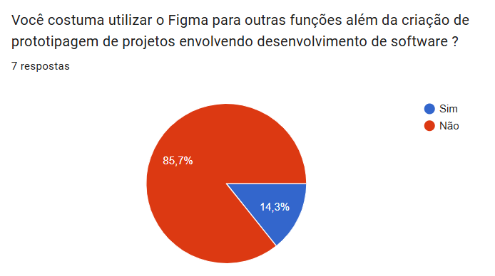

Esse resultado pode indicar que uma grande parcela dos usuários utiliza o Figma exclusivamente para sua proposta principal, ou ainda que parte do público considera a ferramenta complexa de utilizar, o que pode limitar sua aplicação em outros contextos.

Esse cenário também se relaciona com outro questionamento presente na enquete: “Você utilizaria uma nova versão mais simplificada do Figma e totalmente gratuita?”. O resultado obtido foi expressivo,como pode ser observado na figura 2, com 100% dos participantes respondendo “sim”.

---
### Grafico mostrando 100% de confirmação ao questionamento de uma alternativa gratuita e simplificada
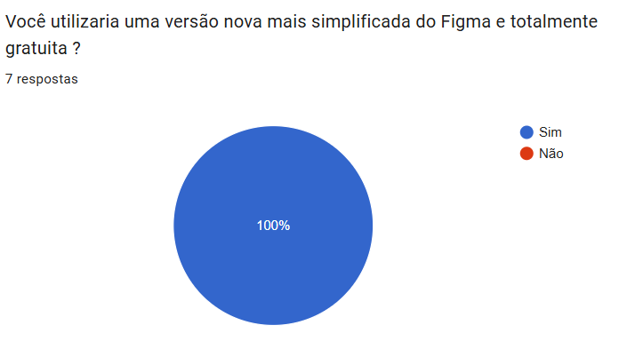

Esse resultado pode estar relacionado a mudanças recentes em algumas funcionalidades do Figma, especialmente no setor de prototipagem, que passaram a fazer parte de planos pagos. Essa alteração pode ter dificultado o processo de desenvolvimento para diversos usuários, principalmente aqueles que utilizam a ferramenta para projetos pessoais ou acadêmicos.

A seguir, apresenta-se um exemplo de feedback fornecido por um dos participantes da pesquisa:

- “Muitas das ferramentas disponíveis no Figma não são intuitivas. Demorei muito tempo para conseguir utilizar a plataforma e só consegui melhorar minhas habilidades depois de assistir a vídeos de outras pessoas demonstrando como realizar determinados processos.”

Esse tipo de retorno reforça a percepção de que, embora o Figma seja uma ferramenta poderosa e amplamente utilizada no desenvolvimento de interfaces, sua curva de aprendizado pode representar um obstáculo para novos usuários, especialmente aqueles que estão iniciando na área de design ou prototipagem.

---

## 1.3 Análise de Soluções Existentes (Benchmark)

Link: https://netstory.io

Público-alvo:
Criadores de histórias digitais e leitores interessados em experiências narrativas interativas.

Funcionalidades principais:

- Criação de histórias interativas
- Navegação por escolhas durante a leitura
- Compartilhamento de conteúdo com o público

Limitações:

- Ecossistema limitado de ferramentas de edição
- Baixa flexibilidade para projetos mais complexos
- Falta de recursos voltados para prototipagem ou design de interfaces
---
### Imagem exemplar
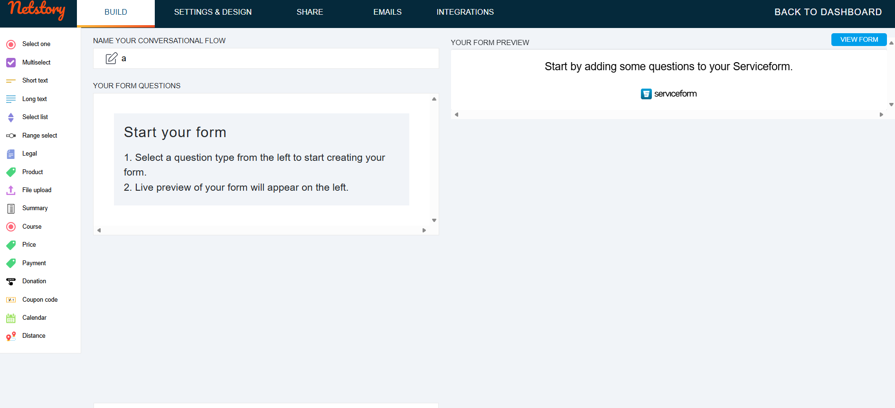

### 2. Squiffy

Link: https://squiffystory.com

Público-alvo:
Autores de ficção interativa e desenvolvedores interessados em criar narrativas ramificadas.

Funcionalidades principais:

- Criação de histórias com escolhas e múltiplos finais
- Estrutura baseada em texto e links narrativos
- Exportação de histórias em formato HTML
- Ferramenta gratuita e open source

Limitações:

- Interface pouco intuitiva para iniciantes
- Pouco suporte a elementos visuais e multimídia
- Não possui recursos colaborativos em tempo real---
---
### Imagem exemplar
  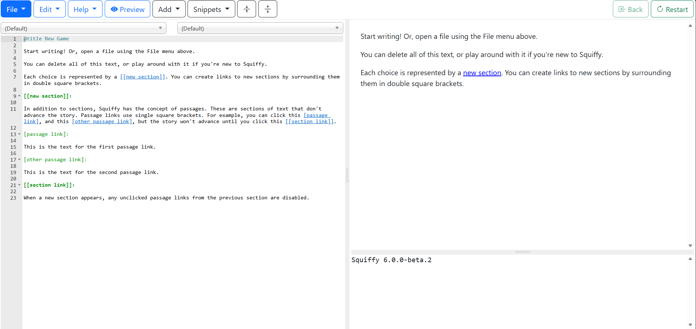

### 3. Figma

Link: https://www.figma.com

Público-alvo:
Designers UI/UX, desenvolvedores e equipes de produto.

Funcionalidades principais:

- Design de interfaces digitais
- Prototipagem interativa
- Colaboração em tempo real
- Compartilhamento e feedback de projetos

Limitações:

- Não voltado para criação narrativa
- Algumas funcionalidades importantes são pagas
- Curva de aprendizado relativamente elevada para iniciantes
---
### Imagem exemplar
  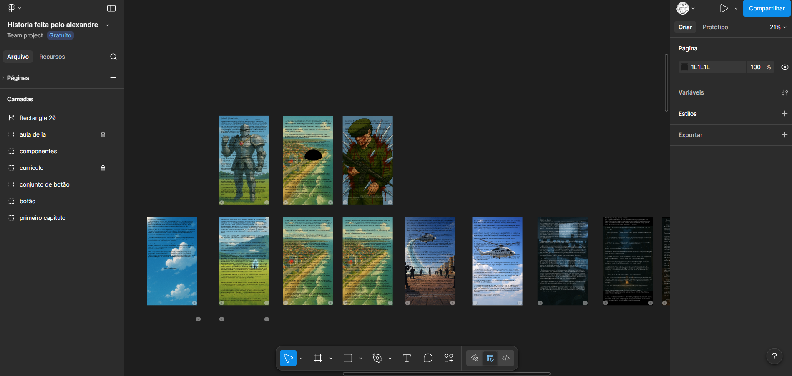

### Comparação
| Solução   | Pontos Fortes                            | Limitações                                  |
| --------- | ---------------------------------------- | ------------------------------------------- |
| Squiffy   | Open source e exportação em HTML         | Interface complexa e pouco intuitiva        |
| Netstory  | Experiência narrativa interativa         | Pouca flexibilidade e ferramentas limitadas |
| Figma     | Colaboração em tempo real e prototipagem | Não voltado para narrativa                  |

### Diferencial do Projeto

A criação desta nova plataforma busca preencher lacunas identificadas nas soluções analisadas.

Atualmente, as ferramentas disponíveis se dividem em dois grupos principais: plataformas focadas na criação de histórias interativas e ferramentas voltadas para design e prototipagem colaborativa. No entanto, não existe uma solução que combine de forma simples e intuitiva essas duas abordagens.

O projeto proposto pretende unir essas funcionalidades em uma única plataforma, permitindo que usuários criem histórias interativas, artigos dinâmicos ou estruturas narrativas complexas, utilizando um ambiente visual semelhante ao de ferramentas de design colaborativo.

O nicho específico atendido pelo projeto inclui escritores, criadores de conteúdo digital, designers e equipes de desenvolvimento que desejam estruturar narrativas interativas ou fluxos de informação de forma visual e colaborativa.

---

## 1.4 Público-Alvo

O sistema será voltado principalmente para usuários interessados em criação de conteúdo interativo e colaboração em projetos narrativos ou de design.

### Os principais usuários do sistema incluem:

- escritores e autores de ficção interativa
- estudantes e criadores de conteúdo digital
- designers de UI/UX
- desenvolvedores que desejam prototipar fluxos narrativos ou experiências interativas

### Contexto de uso

A plataforma poderá ser utilizada em diferentes contextos, como:

- criação de histórias interativas
- desenvolvimento de protótipos narrativos para jogos
- desenvolvimento de protótipos de interface UI/UX
- organização de ideias e fluxos de informação
- produção de conteúdo educacional ou informativo com navegação interativa

O sistema será projetado para atender tanto usuários iniciantes quanto usuários intermediários, priorizando uma interface simples e intuitiva. Dessa forma, não será necessário conhecimento avançado em programação para utilizar a plataforma.

---

## 1.5 Objetivos do Projeto

### Objetivo Geral

Desenvolver uma plataforma digital que permita a criação, organização e publicação de histórias e conteúdos interativos, oferecendo um ambiente colaborativo inspirado em ferramentas de design visual.

---

### Objetivos Específicos

- Desenvolver um editor visual baseado em nós para criação de narrativas interativas
- Permitir colaboração em tempo real entre múltiplos usuários
- Criar um sistema de navegação interativa para os leitores
- Disponibilizar uma interface simples e acessível para usuários iniciantes
- Permitir a privatização de Prototipagem e Projetos 

---

## 1.6 Métricas de Sucesso (KPIs)

- Tempo médio de carregamento inferior a 2 segundos
- Suporte a pelo menos 100 usuários simultâneos na plataforma
- Separação precisa de desenvolvedor para telespectador 
- Nível de satisfação dos usuários superior a 80% em avaliações da plataforma
- feedback positivo de 80% dos usuários referentes ao desenvolvimento

---

# 2. Engenharia de Requisitos

## 2.1 Personas

###  Ana — Escritora

- **Contexto:** Ana é uma estudante de letras que gosta de escrever histórias interativas e artigos
- **Objetivos:**
  - Criar histórias com múltiplos caminhos
  - Publicar conteúdo  
- **Dificuldades:**
  - Ferramentas complexas
  - Opções não dinamicas
  - Dificuldade em organizar narrativa  

---

###  Lucas — Designer

- **Contexto:** Lucas faz parte de uma equipe do setor de UI/UX de uma empresa
- **Objetivos:**
  - Criar protótipos  
  - Colaborar com equipe  
- **Dificuldades:**
  - Curva de aprendizado  
  - Limitações de plano gratuito  

---

###  Rafael — Leitor

- **Contexto:** Consumidor de histórias criadas pelos amigos 
- **Objetivos:**
  - Explorar histórias interativas
  - Incentivar a criação de novos conteúdos 
- **Dificuldades:**
  - Poucas plataformas  
  - Conteúdo desorganizado

###  Gabriel — Estudante

- **Contexto:** Devo criar uma apresentação sobre determinado assunto da faculdade utilizando uma nova ferramenta de elaboração de slides
- **Objetivos:**
  - Elaborar uma apresentação em equipe
  - Explorar novas ferramentas
- **Dificuldades:**
  - Poucas plataformas  
  - Opções tradicionais pouco intuitivas 


---

## 2.2 Casos de Uso Principais

Liste os principais fluxos do sistema.

### Usuário
- Registrar-se
- Logar
- Escolher categoria de login (escritor/leitor)
### Leitor
- Filtrar por obras
- Visualizar obra
- Favoritar obra
- Marcar obra para leitura depois
### Escritor 
- Criar um novo projeto
- Definir equipe
- Selecionar formas
- Definir fluxo
- Editar texto
- Publicar
- definir categoria (privada/publica)
---
### Caso de uso
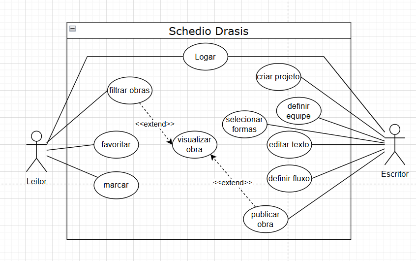

---

## 2.3 Requisitos Funcionais (RF)

# Usuário
Requisitos relacionados à criação e gerenciamento de contas de usuário.
| ID    | Requisito                                                                           |
| ----- | ----------------------------------------------------------------------------------- |
| RF-01 | O sistema deve permitir a **criação de usuário**                                    |
| RF-02 | O sistema deve permitir **login de usuário**                                        |
| RF-03 | O sistema deve permitir **recuperação de senha por e-mail**                         |
| RF-04 | O sistema deve permitir **edição do e-mail da conta**                               |
| RF-05 | O sistema deve permitir **escolher a categoria da sessão (Editor / Telespectador)** |
| RF-06 | O sistema deve permitir **trocar a categoria durante a sessão**                     |

## Navegação de Projetos
Requisitos relacionados à exploração e descoberta de projetos.
| ID    | Requisito                                                     |
| ----- | ------------------------------------------------------------- |
| RF-07 | O sistema deve permitir **navegar entre projetos**            |
| RF-08 | O sistema deve permitir **filtrar projetos**                  |
| RF-09 | O sistema deve permitir **visualizar projetos publicados**    |
| RF-10 | O sistema deve permitir **buscar projetos por palavra-chave** |

# Editor
## Gerenciamento de Projeto
| ID    | Requisito                                                                       |
| ----- | ------------------------------------------------------------------------------- |
| RF-11 | O sistema deve permitir **criar projetos**                                      |
| RF-12 | O sistema deve permitir **editar projetos existentes**                          |
| RF-13 | O sistema deve permitir **salvar projetos manualmente**                         |
| RF-14 | O sistema deve realizar **salvamento automático a cada 10 segundos**            |
| RF-15 | O sistema deve permitir **publicar projetos**                                   |
| RF-16 | O sistema deve permitir **privatizar projetos**                                 |
| RF-17 | O sistema deve permitir **excluir projetos**                                    |
| RF-18 | O sistema deve permitir **gerar links de visualização, colaboração ou preview** |

## Ferramentas de Edição
| ID    | Requisito                                                                |
| ----- | ------------------------------------------------------------------------ |
| RF-19 | O sistema deve permitir **criação e edição de formas**                   |
| RF-20 | O sistema deve permitir **desenhar utilizando a ferramenta pincel**      |
| RF-21 | O sistema deve permitir **selecionar múltiplos objetos simultaneamente** |
| RF-22 | O sistema deve permitir **alterar cores de elementos gráficos**          |
| RF-23 | O sistema deve permitir **inserção e edição de texto**                   |
| RF-24 | O sistema deve permitir **adição de imagens ao projeto**                 |
| RF-25 | O sistema deve permitir **edição de imagens inseridas**                  |

## Estrutura e Navegação
| ID    | Requisito                                                              |
| ----- | ---------------------------------------------------------------------- |
| RF-26 | O sistema deve permitir **criação de telas dentro do projeto**         |
| RF-27 | O sistema deve permitir **edição de telas**                            |
| RF-28 | O sistema deve permitir **navegação entre telas**                      |
| RF-29 | O sistema deve permitir **visualização do mapa estrutural do projeto** |
| RF-30 | O sistema deve permitir **zoom no mapa do projeto**                    |
| RF-31 | O sistema deve permitir **alterar cor do mapa**                        |

## prototipagem 
| ID    | Requisito                                                                              |
| ----- | -------------------------------------------------------------------------------------- |
| RF-32 | O sistema deve permitir **criar transições entre telas**                               |
| RF-33 | O sistema deve permitir **navegação entre telas utilizando a ferramenta de protótipo** |
| RF-34 | O sistema deve permitir **simular navegação interativa do projeto**                    |

# Telespectador
| ID    | Requisito                                                          |
| ----- | ------------------------------------------------------------------ |
| RF-35 | O sistema deve permitir **visualizar projetos publicados**         |
| RF-36 | O sistema deve permitir **comentar em projetos**                   |
| RF-37 | O sistema deve permitir **favoritar projetos**                     |
| RF-38 | O sistema deve permitir **dar like em projetos**                   |
| RF-39 | O sistema deve permitir **reportar projetos**                      |
| RF-40 | O sistema deve permitir **salvar projetos para leitura posterior** |
| RF-41 | O sistema deve permitir **compartilhar projetos**                  |

## 2.4 Requisitos Não Funcionais (RNF)
| ID     | Requisito                                                            |
| ------ | ------------------------------------------------------------------   |
| RNF-01 | O sistema deve possuir **tempo de resposta inferior a 2 segundos**   |
| RNF-02 | O sistema deve suportar **no mínimo 100 usuários simultâneos**       |
| RNF-03 | Senhas devem ser **armazenadas com criptografia segura**             |
| RNF-04 | O sistema deve possuir **controle de acesso baseado em permissões**  |
| RNF-05 | O sistema deve funcionar nos **principais navegadores modernos**     |
| RNF-06 | O sistema deve ser **responsivel com dispositivos desktop e mobile**

---

## 2.5 Regras de Negócio

Esta seção define as regras que controlam o comportamento do sistema.

## Usuário

| ID | Regra |
|----|------|
| RN-01 | O usuário deve estar autenticado para acessar funcionalidades do sistema |
| RN-02 | O e-mail do usuário deve ser único no sistema |
| RN-03 | A troca de categoria (Editor/Telespectador) deve ser permitida apenas durante sessão ativa |

---

## Projetos

| ID | Regra |
|----|------|
| RN-04 | Apenas o criador do projeto pode editá-lo sem permissões |
| RN-05 | Apenas o criador pode excluir um projeto |
| RN-06 | Projetos privados não podem ser visualizados por outros usuários |
| RN-07 | Projetos públicos podem ser acessados por qualquer usuário |
| RN-08 | Um projeto deve possuir ao menos uma tela para ser publicado |

---

## Editor

| ID | Regra |
|----|------|
| RN-09 | Apenas usuários com perfil de Editor podem modificar projetos |
| RN-10 | O sistema deve salvar automaticamente alterações a cada 10 segundos |
| RN-11 | Não é permitido editar um projeto enquanto estiver em modo de visualização pública |
| RN-12 | Transições só podem ser criadas entre telas existentes |

---

## Telespectador

| ID | Regra |
|----|------|
| RN-13 | Apenas usuários autenticados podem dar "like" |
| RN-14 | Um usuário pode dar apenas um "like" por projeto |
| RN-15 | Projetos reportados devem ser analisados posteriormente |
| RN-16 | Usuários podem favoritar múltiplos projetos |

---

## Compartilhamento e Acesso

| ID | Regra |
|----|------|
| RN-17 | Links de compartilhamento devem respeitar a privacidade do projeto |
| RN-18 | Links de colaboração permitem edição apenas para usuários autorizados |
| RN-19 | Links de visualização não permitem edição do projeto |
| RN-20 | Links devem possuir um prazo de validade curto |

---

## 2.6 Fora do Escopo

Esta seção define funcionalidades que **não serão implementadas neste projeto**, com o objetivo de manter o foco, reduzir complexidade e evitar crescimento descontrolado.

---

## Funcionalidades Não Incluídas

| ID | Item fora do escopo | Justificativa |
|----|--------------------|--------------|
| FE-01 | Sistema de pagamento e monetização | Aumenta a complexidade e não é essencial para a proposta inicial |
| FE-02 | Aplicativo mobile nativo (Android/iOS) | O foco será apenas na versão web |
| FE-03 | Integração com redes sociais externas | Pode ser considerado em versões futuras |
| FE-04 | Sistema avançado de IA para geração automática de histórias | Fora do escopo inicial devido à complexidade técnica |
| FE-05 | Edição offline de projetos | Requer sincronização complexa de dados |
| FE-06 | Controle avançado de permissões (níveis detalhados de acesso) | Apenas permissões básicas serão implementadas |
| FE-07 | Sistema completo de chat entre usuários | Não é foco principal da plataforma |
| FE-08 | Marketplace de templates ou projetos | Pode ser explorado futuramente |
| FE-09 | Suporte a plugins ou extensões externas | Aumenta significativamente a complexidade do sistema |
| FE-10 | Versionamento avançado estilo Git | Apenas versionamento básico será considerado |

---

## Considerações

Os itens listados poderão ser considerados em versões futuras do sistema, conforme evolução do projeto e validação com usuários.

O foco inicial será:

- criação de histórias interativas  
- prototipagem visual  
- colaboração básica entre usuários  
---

# 3. Fluxos e Comportamento do Sistema

## 3.1 Fluxo Principal do Usuário
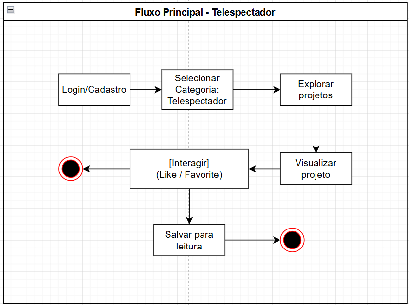

---
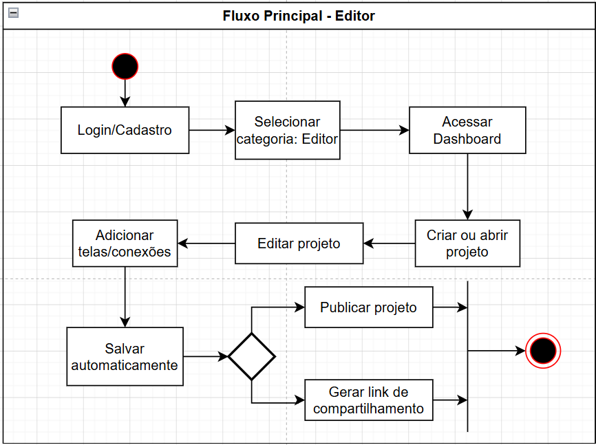
---

## 3.2 Fluxos Alternativos
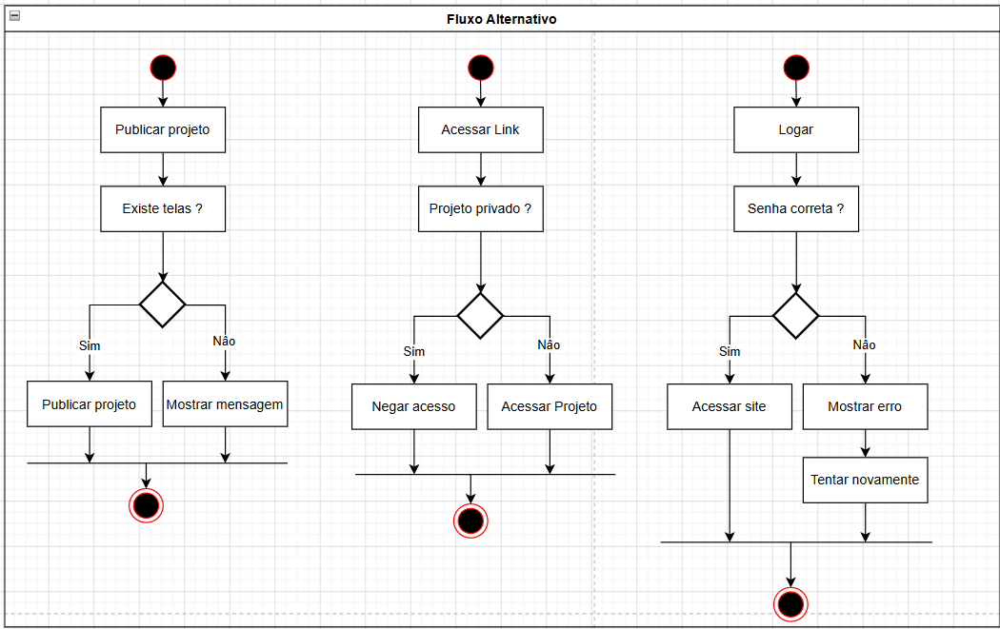
---

# 4. Mockups e Experiência do Usuário (UX)

Esta seção apresenta **a visualização inicial do produto antes da implementação**.

---

## 1 fluxo principal
Esta seção descreve o funcionamento das telas relacionadas à autenticação e gerenciamento de acesso dos usuários.

---

## Login

A tela de login será a primeira interface visualizada pelo usuário ao acessar o sistema.

Nela, o usuário poderá inserir suas credenciais para autenticação e acesso às funcionalidades disponíveis da plataforma.

### Funcionalidades

- autenticação de usuários
- redirecionamento para cadastro
- acesso à recuperação de senha

### Ações disponíveis

- entrar
- criar conta
- recuperar senha

---

## Registrar-se

Esta etapa será destinada a novos usuários que ainda não possuem uma conta na plataforma.

Ao selecionar a opção **"Criar conta"** na tela de login, o usuário será redirecionado para a tela de registro.

Nessa tela serão solicitadas as credenciais necessárias para criação da conta, permitindo posteriormente o acesso ao sistema através da tela de login.

### Funcionalidades

- criação de conta
- validação de dados
- cadastro de credenciais

---

## Recuperação de Senha

A recuperação de senha será um fluxo alternativo destinado a usuários que esqueceram suas credenciais de acesso.

Após uma tentativa de login ou através da opção **"Esqueci minha senha"**, o usuário será redirecionado para a tela de recuperação.

O sistema solicitará o código de autenticação enviado ao e-mail associado à conta.

Após a validação correta do código, o usuário será direcionado para a redefinição de senha.

Para redefinir sua senha, o usuário deverá informar a nova senha e confirmá-la novamente.

### Funcionalidades

- envio de código de autenticação
- validação do código
- redefinição de senha

### Fluxo

Login → Esqueci minha senha → Código por e-mail → Redefinir senha → Login

---
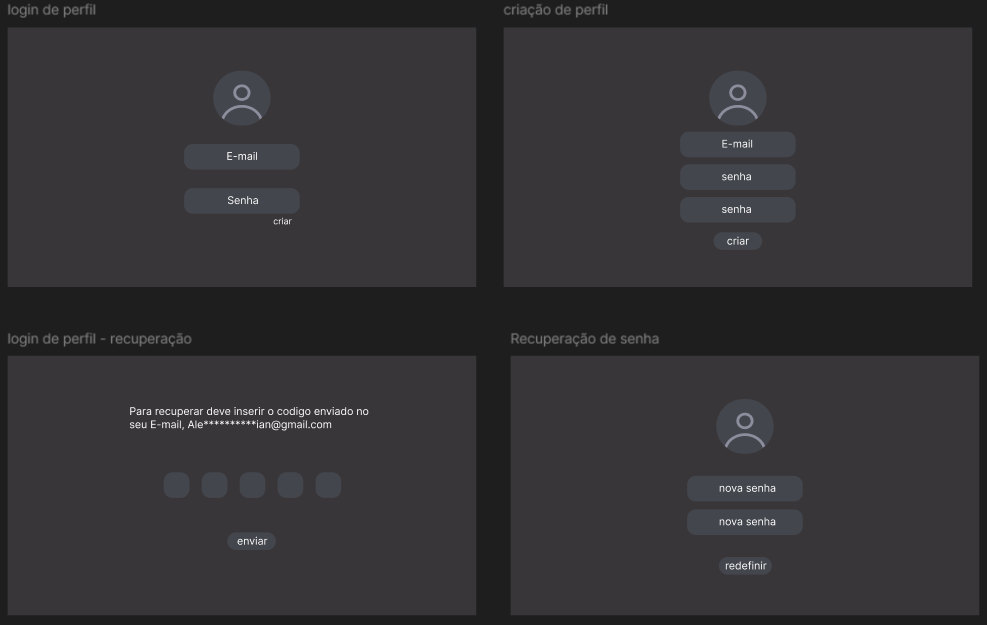
---

## 2 Fluxo de usuário

Esta seção descreve as principais telas disponíveis para navegação e interação do usuário dentro da plataforma.

---

## Tela Inicial

A tela inicial será o primeiro contato visual do usuário com a plataforma, funcionando como a principal porta de entrada do sistema.

Nela, o usuário poderá acessar a área de edição de projetos, realizar login em sua conta e visualizar obras publicadas por outros editores da comunidade.

Além disso, poderá acessar seu próprio perfil e as demais funcionalidades da conta.

A interface foi planejada para facilitar a descoberta de novos conteúdos e tornar o acesso às principais funcionalidades mais intuitivo.

### Funcionalidades

- acessar a área de edição de projetos
- visualizar obras publicadas
- explorar projetos da comunidade
- pesquisar projetos
- acessar perfil pessoal

### Objetivos da Tela

- apresentar a proposta da plataforma
- facilitar acesso ao editor
- incentivar exploração de conteúdos
- destacar projetos da comunidade
- centralizar navegação principal do sistema

## Tela de Usuário

A tela de usuário funcionará como o perfil principal da conta, permitindo personalização das informações públicas e gerenciamento das configurações pessoais da plataforma.

Nessa área, o usuário poderá configurar quais informações outros usuários poderão visualizar ao acessar seu perfil, além de personalizar elementos da conta e acompanhar informações relacionadas às suas atividades dentro da plataforma.

Também será possível visualizar projetos já desenvolvidos, quantidade de likes recebidos e acessar a área de segurança da conta.

### Funcionalidades

- alterar nome de usuário
- alterar foto de perfil
- adicionar ou editar biografia
- adicionar informações pessoais públicas
- visualizar quantidade de likes recebidos
- visualizar projetos publicados
- acessar configurações da conta
- alterar senha
- alterar tema/cor de fundo
- excluir conta

### Objetivos da Tela

- centralizar informações do usuário
- permitir personalização do perfil
- facilitar gerenciamento da conta
- exibir atividade pública do usuário
- melhorar interação social da plataforma

---
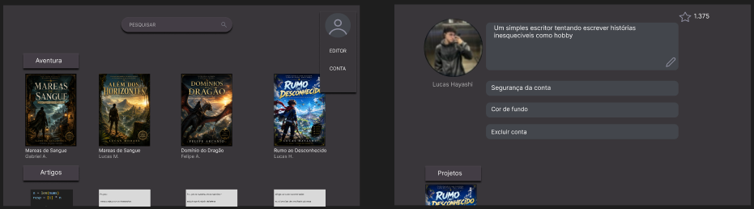
---

## 3 Fluxo de leitor

Esta seção descreve o funcionamento das principais telas disponíveis para leitores dentro da plataforma.

O fluxo foi planejado para facilitar a descoberta de conteúdos, incentivar a interação com obras publicadas e proporcionar uma experiência intuitiva durante a leitura de histórias interativas, artigos e outros projetos criados pela comunidade.

---

## Tela Inicial

Nessa tela, o leitor poderá visualizar obras publicadas por diversos escritores, organizadas por categorias.

Os conteúdos disponíveis poderão variar entre:

- histórias de aventura
- artigos
- teses científicas
- protótipos de aplicações UI/UX
- projetos interativos

Através da barra de pesquisa, também será possível procurar tanto pelo nome das obras quanto pelos nomes de seus respectivos criadores.

A tela inicial funcionará como principal área de descoberta de conteúdos da plataforma.

### Funcionalidades

- visualizar obras publicadas
- navegar por categorias
- pesquisar obras
- pesquisar escritores
- acessar histórias salvas
- acessar perfil do usuário

### Objetivos da Tela

- facilitar descoberta de conteúdos
- organizar projetos por categorias
- incentivar interação entre leitores e criadores
- simplificar acesso às obras publicadas

---

## Primeira Visualização do Projeto

Nesta etapa, o leitor poderá visualizar informações mais detalhadas sobre o projeto selecionado.

A tela apresentará uma pequena sinopse ou explicação fornecida pelo criador da obra, além de informações como:

- nome do projeto
- nome do criador
- data de publicação

### Funcionalidades

- visualizar sinopse da obra
- visualizar informações do criador
- visualizar capa do projeto
- curtir projeto
- salvar para ler mais tarde
- denunciar conteúdo
- iniciar leitura

### Objetivos da Tela

- apresentar informações detalhadas do projeto
- incentivar interação social
- facilitar decisão de leitura
- permitir avaliação inicial da obra

---

## Tela de Visualização

Após clicar em **"Ler"** na tela anterior, o usuário será direcionado para a área principal de visualização do projeto.

Nessa tela será possível visualizar o conteúdo desenvolvido pelo editor e navegar entre as diferentes telas da obra.

A navegação poderá ocorrer através:

- das setas disponíveis na interface
- de interações adicionadas pelo criador
- de escolhas feitas durante a leitura

O usuário também poderá retornar para a tela anterior a qualquer momento.

### Funcionalidades

- visualizar conteúdo da obra
- avançar entre telas
- retornar etapas anteriores
- interagir com elementos da história
- realizar escolhas interativas
- navegar por conexões criadas pelo autor

### Objetivos da Tela

- proporcionar leitura interativa
- permitir navegação dinâmica
- aumentar imersão do leitor
- facilitar interação com o conteúdo

---

## Fluxo Alternativo

Na tela principal, caso o usuário tenha salvo uma história para leitura posterior, a plataforma passará a priorizar essas obras.

Nesse cenário, os projetos salvos aparecerão na parte superior da interface inicial, enquanto os demais projetos publicados pela comunidade permanecerão logo abaixo.

Esse comportamento tem como objetivo facilitar a retomada de leituras já iniciadas ou marcadas pelo usuário.

### Funcionalidades

- priorizar histórias salvas
- facilitar retomada de leitura
- reorganizar conteúdos da tela inicial

### Objetivos do Fluxo Alternativo

- melhorar experiência do usuário
- facilitar continuidade da leitura
- destacar conteúdos favoritos do leitor

---
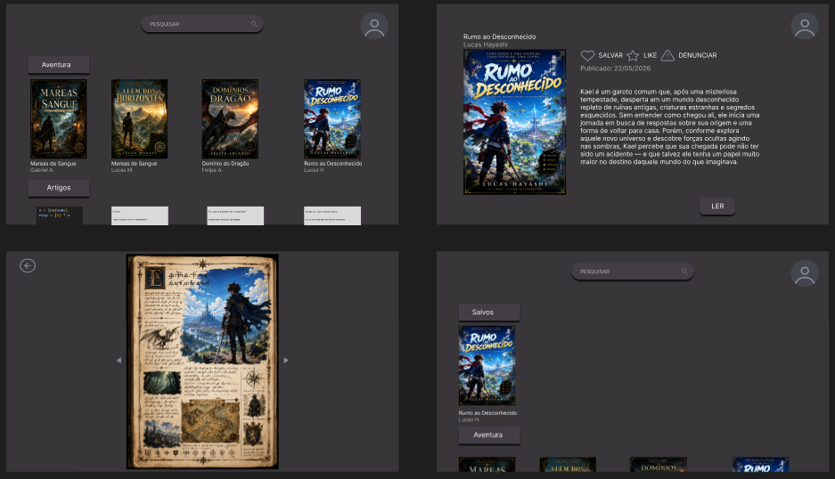
---


## Fluxo do Editor

Esta seção descreve o funcionamento das principais telas disponíveis para usuários criadores dentro da plataforma.

O fluxo foi planejado para permitir gerenciamento de projetos, criação de histórias interativas e desenvolvimento de protótipos de forma simples, intuitiva e visual.

---

## Visualização de Projetos

Nesta tela ficarão disponíveis todos os projetos criados pelo editor, incluindo:

- projetos finalizados
- projetos em andamento
- projetos publicados
- projetos privados

O usuário poderá visualizar, pesquisar e gerenciar facilmente todas as suas obras através de uma interface organizada.

Também será possível criar novos projetos ou remover projetos já existentes.

### Funcionalidades

- visualizar projetos criados
- pesquisar projetos
- criar novo projeto
- excluir projeto
- visualizar projetos publicados
- visualizar projetos privados
- acessar editor de projetos

### Objetivos da Tela

- centralizar gerenciamento dos projetos
- facilitar acesso às obras criadas
- simplificar organização dos projetos
- agilizar criação de novos conteúdos

---

## Editor de Projeto

O editor de projetos será o principal componente da plataforma, funcionando de maneira semelhante ao Figma, porém adaptado para criação de histórias interativas, fluxos narrativos e protótipos visuais.

Nessa área, o criador terá acesso às ferramentas necessárias para construção e edição de seus projetos, assim como criar links de compartilhamento para ter ajuda de outros editores com certas permissões.

Será possível adicionar:

- imagens
- textos
- formas
- conexões
- interações
- fluxos entre telas

O editor também permitirá criação de histórias com múltiplos caminhos, onde o rumo da narrativa poderá mudar dependendo das interações realizadas pelo leitor.

### Funcionalidades

- adicionar imagens
- adicionar textos
- adicionar formas
- editar elementos visuais
- alterar cores
- alterar tamanhos
- movimentar objetos
- gerenciar links
- criar conexões entre telas
- definir interações
- criar caminhos alternativos
- visualizar fluxo do projeto
- salvar projeto
- salvamento automático

### Objetivos da Tela

- permitir criação visual de projetos
- facilitar desenvolvimento de histórias interativas
- simplificar criação de fluxos narrativos
- proporcionar edição intuitiva
- permitir prototipagem visual

---

## Perfil de Criador

Esta será a tela pública de visualização do perfil do criador.

Semelhante ao perfil de usuário, essa área será destinada à exibição das informações públicas do editor e de suas obras publicadas.

Os leitores poderão visualizar:

- nome do criador
- biografia
- projetos publicados
- continuidade de histórias e projetos

### Funcionalidades

- visualizar perfil público
- visualizar biografia do criador
- visualizar obras publicadas
- acompanhar continuidade de projetos
- acessar projetos publicados

### Objetivos da Tela

- destacar criadores da plataforma
- facilitar descoberta de obras
- incentivar interação entre leitores e criadores
- centralizar projetos publicados do editor

---
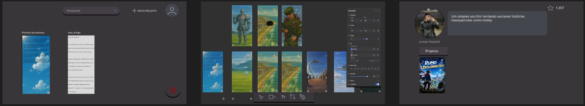
---

# 5. Arquitetura do Sistema

Esta seção demonstra **como o sistema será construído**.

---

## 5.1 Diagrama C4

## Nível 1 — Diagrama de Contexto

O diagrama de contexto apresenta a visão macro do sistema e suas interações externas.

### Atores principais

- Escritor
- Telespectador

### Sistemas externos

- Banco de dados PostgreSQL
- Serviço de armazenamento de imagens
- MongoDB → estado do editor

---

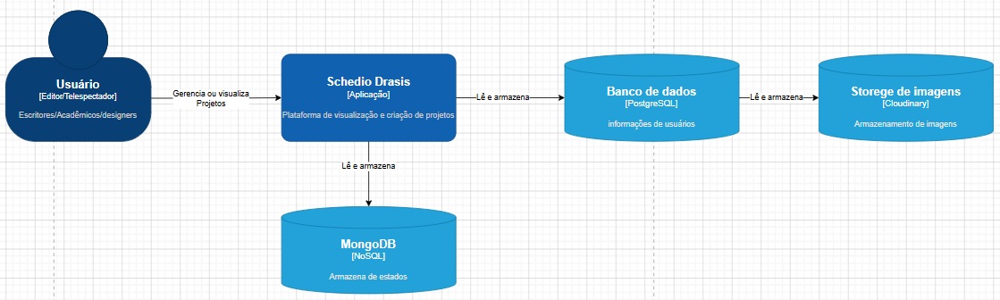

---
## Nível 2 — Diagrama de Containers

O diagrama abaixo apresenta a arquitetura de alto nível do sistema, demonstrando os principais containers responsáveis pela interface, processamento e persistência de dados.

---

## Containers do Sistema

| Container | Tecnologia | Responsabilidade |
|---|---|---|
| Frontend Web | React | Interface do usuário |
| API Backend | Node.js + Express | Regras de negócio e processamento |
| Banco de Dados | PostgreSQL | Persistência de dados |
| MongoDB | Banco NoSQL | Estado dos projetos |
| Storage | Cloudinary | Armazenamento de imagens e assets |

---

## Comunicação

| Origem | Destino | Protocolo |
|---|---|---|
| Frontend | API Backend | HTTPS/JSON |
| API Backend | PostgreSQL | SQL |
| API Backend | MongoDB | NoSQL |
| API Backend | Cloudinary | REST API |

---

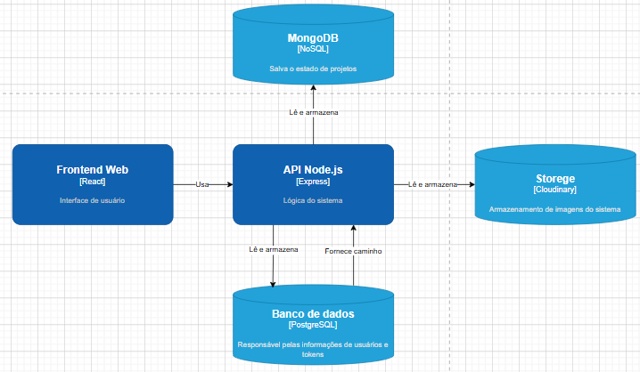

---

# Nível 3 — Diagrama de Componentes

O diagrama abaixo apresenta a organização interna da API backend do sistema.

A arquitetura foi estruturada utilizando separação em camadas, facilitando manutenção, organização e escalabilidade futura.

---

## Componentes Internos

| Componente | Responsabilidade |
|---|---|
| Login Controller | Receber requisições de autenticação |
| Auth Service | Validar credenciais e regras de autenticação |
| Token Service | Gerar e validar tokens JWT |
| User Repository | Persistir dados de usuários |
| Project Controller | Receber requisições relacionadas aos projetos |
| Project Service | Aplicar regras de negócio dos projetos |
| Image Service | Gerenciar upload de imagens |
| Project Repository | Persistir projetos e dados relacionados |

---

## Fluxo Interno

Controller → Service → Repository → Banco de Dados

---

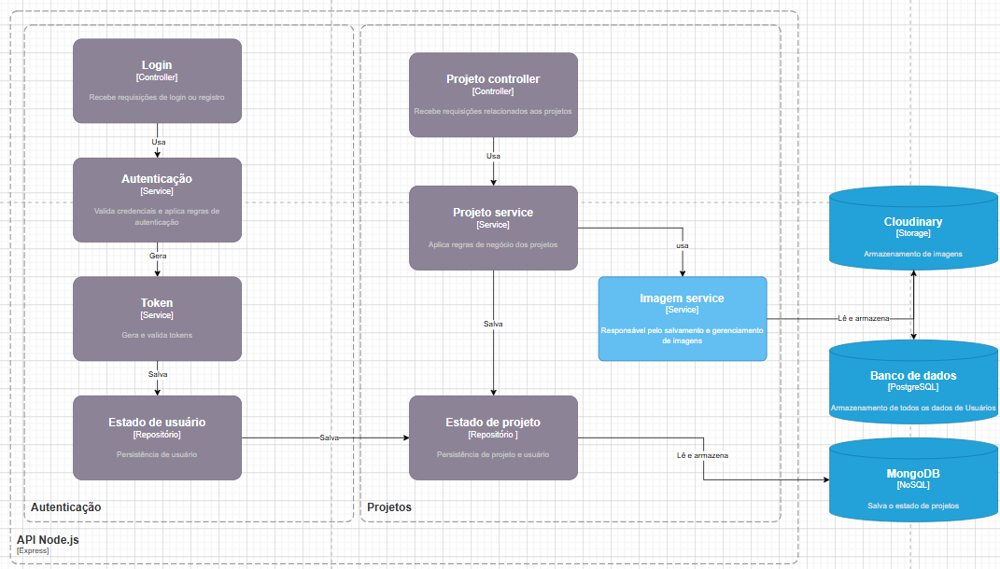

---

## 5.2 Modelo de Dados

Esta seção apresenta a estrutura de persistência utilizada pelo sistema, incluindo os modelos relacionais e não relacionais responsáveis pelo armazenamento das informações da plataforma.

O sistema utiliza uma arquitetura híbrida de dados, combinando bancos relacionais e NoSQL para atender diferentes necessidades da aplicação.

---

# Modelo Relacional (PostgreSQL)

O PostgreSQL será responsável pelo armazenamento de dados estruturados da plataforma.

Entre os principais dados persistidos estão:

- usuários
- autenticação
- curtidas
- favoritos
- permissões
- metadados dos projetos

---

## Principais Entidades

| Entidade | Responsabilidade |
|---|---|
| usuarios | armazenamento de usuários |
| projetos | informações gerais dos projetos |
| imagens  | armazenamento de imagens |

---

## Relacionamentos

- um usuário pode possuir vários projetos
- um usuário pode curtir vários projetos
- um usuário pode salvar vários projetos
- um usuário pode denunciar projetos
- um projeto pode possuir varias imagens

---
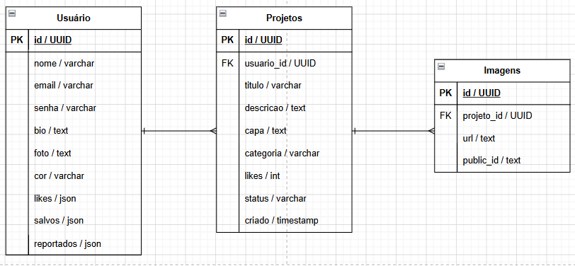
---
# Modelo NoSQL (MongoDB)

O MongoDB será responsável pelo armazenamento do estado dinâmico do editor visual e da estrutura dos projetos interativos.

A escolha do MongoDB ocorreu devido à flexibilidade no armazenamento de estruturas complexas e variáveis.

---

## Estruturas Armazenadas

- telas
- conexões
- elementos visuais
- posições
- interações
- estados do editor

---

## Modelo de Documento

```json
{
  "projectId": "123",
  "screens": [
    {
      "id": "screen-01",
      "title": "Introdução",
      "elements": [
        {
          "type": "text",
          "content": "Bem-vindo à história"
        },
        {
          "type": "image",
          "url": "image.png"
        }
      ],
      "connections": [
        {
          "target": "screen-02",
          "action": "button-click"
        }
      ]
    }
  ]
}
```
---

# Armazenamento de Imagens

As imagens utilizadas nos projetos serão armazenadas utilizando Cloudinary.

O sistema armazenará apenas:

- URLs públicas
- identificadores das imagens
- metadados necessários

---

# Objetivos do Modelo de Dados

- organizar persistência da aplicação
- separar dados relacionais e dinâmicos
- facilitar escalabilidade futura
- melhorar organização arquitetural
- simplificar manutenção do sistema

## 5.3 Principais Componentes

Esta seção apresenta os principais módulos responsáveis pelo funcionamento do sistema.

Os componentes foram organizados de forma modular para facilitar manutenção, escalabilidade e separação de responsabilidades.

---

## Frontend Web

Responsável pela interface visual da aplicação e interação com os usuários.

### Funcionalidades

- renderização das telas
- editor visual
- navegação entre projetos
- autenticação visual
- visualização de Projetos
- gerenciamento de estado da interface

### Tecnologias

- React
- JavaScript
- CSS

---

## API Backend

Responsável pelo processamento das requisições e aplicação das regras de negócio.

### Funcionalidades

- gerenciamento de usuários
- autenticação
- gerenciamento de projetos
- controle de permissões
- comunicação com bancos de dados
- integração com serviços externos

### Tecnologias

- Node.js
- Express.js

---

## Sistema de Autenticação

Módulo responsável pela autenticação e autorização de usuários.

### Funcionalidades

- login
- cadastro
- recuperação de senha
- geração de tokens JWT
- validação de sessão
- controle de permissões

### Tecnologias

- JWT
- bcrypt

---

## Módulo do Editor Visual

Responsável pela criação e edição de histórias interativas e protótipos.

### Funcionalidades

- criação de telas
- conexões entre telas
- edição de elementos visuais
- zoom e navegação
- salvamento automático
- gerenciamento do estado do editor

### Tecnologias

- React
- MongoDB

---

## Camada de Persistência

Responsável pelo armazenamento e recuperação de dados da aplicação.

### PostgreSQL

Armazena dados estruturados:

- usuários
- autenticação
- curtidas
- favoritos

### MongoDB

Armazena dados dinâmicos do editor:

- telas
- conexões
- elementos gráficos
- estados do projeto

---

## Módulo de Armazenamento de Imagens

Responsável pelo upload e gerenciamento de imagens utilizadas nos projetos.

### Funcionalidades

- upload de imagens
- armazenamento em nuvem
- geração de URLs públicas
- otimização de imagens

### Tecnologia

- Cloudinary

---

## Sistema de Compartilhamento

Responsável pela publicação e compartilhamento dos projetos.

### Funcionalidades

- geração de links públicos
- compartilhamento de projetos
- controle de privacidade
- visualização pública

---

## Resumo dos Componentes

| Componente | Responsabilidade |
|---|---|
| Frontend Web | Interface do usuário |
| API Backend | Regras de negócio |
| Sistema de Autenticação | Login e segurança |
| Editor Visual | Criação de projetos |
| Camada de Persistência | Armazenamento de dados |
| Storage de Imagens | Upload e gerenciamento de assets |
| Sistema de Compartilhamento | Publicação de projetos |

---

# 5.4 Stack Tecnológica

Esta seção apresenta as principais tecnologias utilizadas no desenvolvimento do sistema, bem como a justificativa técnica para suas escolhas.

---

## Frontend

### React

**Categoria:** Biblioteca Frontend

O React foi escolhido pela facilidade na criação de interfaces interativas e componentizadas, permitindo maior organização do código e reutilização de componentes da interface do editor visual.

Também oferece boa integração com APIs REST e gerenciamento eficiente de estados da aplicação.

---

## Backend

### Node.js

**Categoria:** Ambiente de execução JavaScript

O Node.js foi escolhido pela simplicidade de integração com o frontend em JavaScript e pela boa capacidade de lidar com múltiplas requisições assíncronas, tornando-o adequado para aplicações web interativas.

---

### Express.js

**Categoria:** Framework Backend

O Express foi utilizado para facilitar a criação da API REST, gerenciamento de rotas e organização da lógica do servidor.

Sua estrutura simples e flexível torna o desenvolvimento mais rápido para projetos MVP e aplicações de pequeno porte.

---

## Banco de Dados

### PostgreSQL

**Categoria:** Banco de Dados Relacional

O PostgreSQL foi escolhido para armazenar dados estruturados do sistema, como:

- usuários
- autenticação
- curtidas
- permissões

A tecnologia oferece confiabilidade, segurança e suporte a relacionamentos complexos entre entidades.

---

### MongoDB

**Categoria:** Banco de Dados NoSQL

O MongoDB foi utilizado para persistência do estado do editor visual e da estrutura dos projetos interativos.

Sua estrutura orientada a documentos facilita o armazenamento de dados dinâmicos como:

- telas
- conexões
- elementos gráficos
- posicionamento visual
- estados do projeto

---

## Armazenamento de Imagens

### Cloudinary

**Categoria:** Storage em Nuvem

O Cloudinary foi escolhido para armazenamento de imagens e assets do sistema.

A plataforma oferece:

- hospedagem de imagens
- otimização automática
- compressão
- geração de URLs públicas
- facilidade de integração com aplicações web

---

## Autenticação

### JWT (JSON Web Token)

**Categoria:** Autenticação

JWT foi utilizado para autenticação de usuários e controle de sessões da aplicação.

A tecnologia permite autenticação stateless, reduzindo a necessidade de armazenamento de sessões no servidor.

---

## Interface e Prototipagem

### Figma

**Categoria:** Design UI/UX

O Figma foi utilizado para criação dos mockups, wireframes e prototipagem inicial da interface do sistema.

---

## Versionamento

### Git e GitHub

**Categoria:** Controle de versão

Utilizados para versionamento do código-fonte, organização do desenvolvimento e hospedagem pública da documentação do projeto.

---

## Resumo da Stack

| Tecnologia | Categoria | Responsabilidade |
|---|---|---|
| React | Frontend | Interface do usuário |
| Node.js | Backend | Execução do servidor |
| Express.js | Framework Backend | API REST |
| PostgreSQL | Banco Relacional | Dados estruturados |
| MongoDB | Banco NoSQL | Estado do editor |
| Cloudinary | Storage | Imagens e assets |
| JWT | Autenticação | Controle de sessão |
| Git/GitHub | Versionamento | Controle de código |
| Figma | UI/UX | Prototipagem |

---

# 6. Segurança e Privacidade

Esta seção apresenta as medidas de segurança adotadas pelo sistema para proteção dos dados dos usuários e garantia da integridade da plataforma.

O projeto foi desenvolvido seguindo boas práticas de desenvolvimento seguro, com foco na proteção das informações armazenadas e na privacidade dos usuários.

---

## Medidas de Segurança

### Autenticação e Autorização

O sistema utilizará autenticação baseada em login e senha para identificação dos usuários.

Após a autenticação, serão gerados tokens de acesso que permitirão a utilização das funcionalidades da plataforma de forma segura.

#### Implementações

- autenticação por e-mail e senha
- utilização de tokens JWT
- validação de permissões de acesso
- controle de sessões autenticadas

---

### Criptografia de Dados Sensíveis

Dados sensíveis armazenados pelo sistema receberão tratamento adequado para evitar acessos não autorizados.

#### Implementações

- criptografia de senhas utilizando algoritmos seguros
- proteção de informações sensíveis durante a autenticação
- armazenamento seguro de credenciais

---

### Proteção Contra Vulnerabilidades Comuns

O sistema adotará práticas básicas de desenvolvimento seguro visando reduzir riscos de exploração.

#### Implementações

- validação de entradas do usuário
- proteção contra SQL Injection
- proteção contra Cross-Site Scripting (XSS)
- proteção contra acesso não autorizado a recursos privados
- validação de permissões em operações críticas

### Segurança da API

A API do sistema seguirá boas práticas de desenvolvimento seguro para evitar vulnerabilidades comuns relacionadas ao processamento de dados enviados pelos usuários.

#### Implementações

- utilização de consultas parametrizadas
- validação de todos os dados recebidos pela API
- sanitização de entradas do usuário
- limitação de tamanho de campos enviados
- validação de tipos de dados
- utilização de ORM para abstração de consultas ao banco de dados
- controle de permissões por rota

#### Proteção Contra SQL Injection

O sistema não realizará concatenação direta de valores enviados pelo usuário em consultas SQL.

Exemplo inseguro:

```sql
SELECT * FROM users WHERE email = '${email}'
```

Exemplo seguro:

```sql
SELECT * FROM users WHERE email = $1
```

ou utilizando ORM:

```javascript
const user = await User.findOne({
  where: { email }
});
```
Dessa forma, os dados enviados pelo usuário são tratados separadamente da consulta SQL, impedindo tentativas de manipulação maliciosa.

#### Proteção Contra Entradas Maliciosas

Todos os dados recebidos pela API passarão por validação antes de serem processados.

Exemplos:

- validação de e-mails
- validação de senhas
- validação de UUIDs
- validação de tamanho de textos
- bloqueio de caracteres inválidos quando necessário

#### Objetivos

- prevenir SQL Injection
- reduzir riscos de execução de comandos indevidos
- garantir integridade dos dados
- aumentar a confiabilidade da API

---

## Conformidade com a LGPD

O sistema seguirá os princípios da Lei Geral de Proteção de Dados (LGPD), coletando apenas as informações necessárias para funcionamento da plataforma.

---

## Dados Coletados

Serão coletados apenas os dados essenciais para utilização do sistema.

### Dados de Cadastro

- nome de usuário
- e-mail
- senha

### Dados de Perfil

- foto de perfil (opcional)
- biografia (opcional)
- preferências de personalização

### Dados de Utilização

- projetos criados
- projetos curtidos
- projetos salvos
- histórico básico de utilização da plataforma

---

## Armazenamento dos Dados

Os dados serão armazenados em bancos de dados protegidos e utilizados exclusivamente para funcionamento da plataforma.

As senhas não serão armazenadas em formato legível, sendo protegidas por mecanismos de criptografia adequados.

---

## Direitos do Usuário

O usuário terá controle sobre suas informações dentro da plataforma.

### Funcionalidades Disponíveis

- editar informações do perfil
- alterar nome de usuário
- alterar foto de perfil
- alterar senha
- remover conteúdos publicados
- excluir permanentemente sua conta

---

## Remoção de Dados

A qualquer momento o usuário poderá solicitar a exclusão de sua conta através das configurações do perfil.

Após a exclusão:

- os dados da conta serão removidos do sistema
- as credenciais de acesso deixarão de existir
- os conteúdos associados poderão ser removidos ou anonimizados conforme as regras da plataforma

---

## Objetivos de Segurança

- proteger informações dos usuários
- garantir autenticação segura
- reduzir riscos de acesso não autorizado
- cumprir princípios básicos da LGPD
- oferecer transparência sobre utilização dos dados
---

# 7. Planejamento do Projeto

Esta seção apresenta os principais marcos previstos para o desenvolvimento do sistema.

O planejamento foi estruturado de forma incremental, permitindo validação contínua das funcionalidades e evolução gradual do projeto.

| Marco | Descrição | Prazo |
|---------|---------|---------|
| M1 | Levantamento de requisitos, pesquisa de mercado e definição do escopo | Semana 1 |
| M2 | Criação da documentação inicial, personas e regras de negócio | Semana 2 |
| M3 | Desenvolvimento dos mockups, wireframes e fluxos de usuário | Semana 3 |
| M4 | Definição da arquitetura do sistema e modelagem do banco de dados | Semana 4 |
| M5 | Configuração do ambiente de desenvolvimento e criação da estrutura base do projeto | Semana 5 |
| M6 | Implementação do sistema de autenticação (login, cadastro e recuperação de senha) | Semana 6 |
| M7 | Implementação do gerenciamento de usuários e perfis | Semana 7 |
| M8 | Desenvolvimento do editor visual de projetos (MVP) | Semana 8 |
| M9 | Implementação do sistema de projetos e publicação | Semana 9 |
| M10 | Implementação da visualização de projetos para leitores | Semana 10 |
| M11 | Implementação de likes, favoritos e histórico de leitura | Semana 11 |
| M12 | Integração com armazenamento de imagens (Cloudinary) | Semana 12 |
| M13 | Testes funcionais e correção de bugs | Semana 13 |
| M14 | Melhorias de interface, usabilidade e desempenho | Semana 14 |
| M15 | Documentação final e preparação para apresentação | Semana 15 |

---

## Principais Entregas

### Entrega 1 — Planejamento

- levantamento de requisitos
- benchmark
- personas
- regras de negócio
- documentação inicial

### Entrega 2 — Protótipo

- wireframes
- mockups
- fluxo de navegação
- validação da experiência do usuário

### Entrega 3 — MVP Funcional

- autenticação
- gerenciamento de usuários
- criação de projetos
- editor visual básico

### Entrega 4 — Plataforma Completa

- publicação de projetos
- visualização para leitores
- sistema de likes
- salvamento de projetos

### Entrega 5 — Finalização

- testes
- correções
- documentação final
- apresentação do projeto

---

## Objetivo Final

Ao final do desenvolvimento, a plataforma deverá permitir que escritores e criadores desenvolvam projetos interativos de forma visual, publiquem suas obras e disponibilizem experiências interativas para os leitores através de um ambiente simples e intuitivo.

---

## 8. Referências

Esta seção reúne as principais referências utilizadas durante a concepção, modelagem e desenvolvimento do projeto.

---

## Ferramentas de Design e Prototipagem

### Figma

Disponível em: https://www.figma.com

Utilizado como principal referência para estudo de interfaces colaborativas e ferramentas de prototipagem visual.

### Squiffy

Disponível em: https://squiffystory.com

Utilizado como referência para criação de histórias interativas baseadas em escolhas do usuário.

### Netstory

Disponível em: https://netstory.io

Utilizado como referência para sistemas de narrativa interativa e publicação de histórias.

---

## Plataformas de Publicação e Leitura

### Livraria Pública

Disponível em: https://livrariapublica.com.br

Utilizada como referência para organização e disponibilização de conteúdos literários.

### MangaDex

Disponível em: https://mangadex.org

Utilizada como referência para navegação, categorização e leitura de conteúdos publicados pela comunidade.

### Fliptru

Disponível em: https://fliptru.com.br/mkt/about

Utilizada como referência para publicação de histórias digitais e interação entre autores e leitores.

---

## Segurança da Informação

### PortSwigger Web Security Academy

Disponível em: https://portswigger.net/web-security/sql-injection

Utilizada para estudo de vulnerabilidades SQL Injection e práticas de desenvolvimento seguro.

---

## Banco de Dados

### MySQL

Disponível em: https://www.mysql.com

Utilizado como referência para modelagem relacional e conceitos de persistência de dados.

---

## Ferramentas de Desenvolvimento

### Visual Studio Code

Disponível em: https://code.visualstudio.com

Ambiente de desenvolvimento utilizado para implementação do projeto.

### GitHub Copilot

Disponível em: https://github.com/features/copilot

Ferramenta de inteligência artificial utilizada como apoio à programação durante o desenvolvimento do projeto.

### DataGrip

Disponível em: https://www.jetbrains.com/help/datagrip/getting-started.html

Utilizado como referência para gerenciamento e manipulação de bancos de dados.

---
## Ferramentas de Apoio ao Desenvolvimento

### ChatGPT (OpenAI)

Disponível em: https://chatgpt.com

Utilizado como ferramenta de apoio durante o desenvolvimento do projeto, auxiliando na elaboração da documentação, levantamento de requisitos, definição da arquitetura do sistema, modelagem de banco de dados, organização de fluxos de usuário, revisão textual e esclarecimento de conceitos técnicos relacionados ao desenvolvimento web.

### GitHub Copilot

Disponível em: https://github.com/features/copilot

Utilizado como assistente de programação integrado ao Visual Studio Code, auxiliando na geração de código, sugestões de implementação, correção de erros e aumento da produtividade durante o desenvolvimento do sistema.

---

## Estudos e Documentação Técnica

* Documentação oficial do Figma.
* Documentação oficial do MongoDB.
* Documentação oficial do PostgreSQL.
* Documentação oficial do Node.js.
* Documentação oficial do Cloudinary.
* Documentação oficial do React.
* Materiais relacionados à experiência do usuário (UX/UI).
* Materiais sobre UX/UI Design.
* Materiais sobre desenvolvimento de aplicações web colaborativas.
* Materiais relacionados à Lei Geral de Proteção de Dados (LGPD).
* Materiais relacionados ao OWASP Top 10.
* Materiais já desenvolvidos anteriormente pelo acadêmico.

---

# 9. Parecer do Comitê de Avaliação

(A ser preenchido pelos professores)

**Avaliador 1:** Manfred Heil Junior
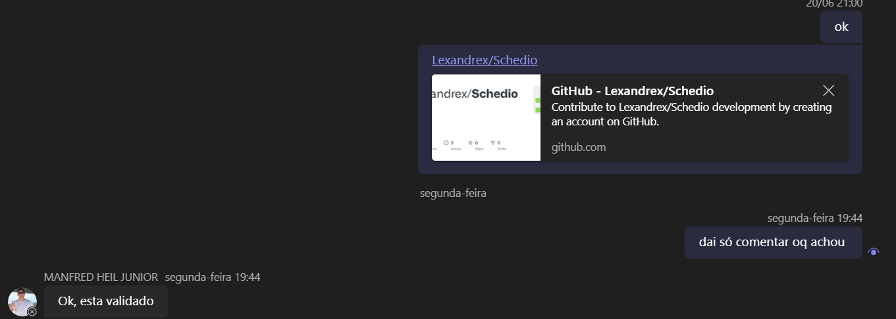
**Status:** [X] Aprovado  [ ] Ajustar

Observações:

---

**Avaliador 2:** __________________________  
**Status:** [ ] Aprovado  [ ] Ajustar

Observações:

---

**Avaliador 3:** __________________________  
**Status:** [ ] Aprovado  [ ] Ajustar

Observações:
